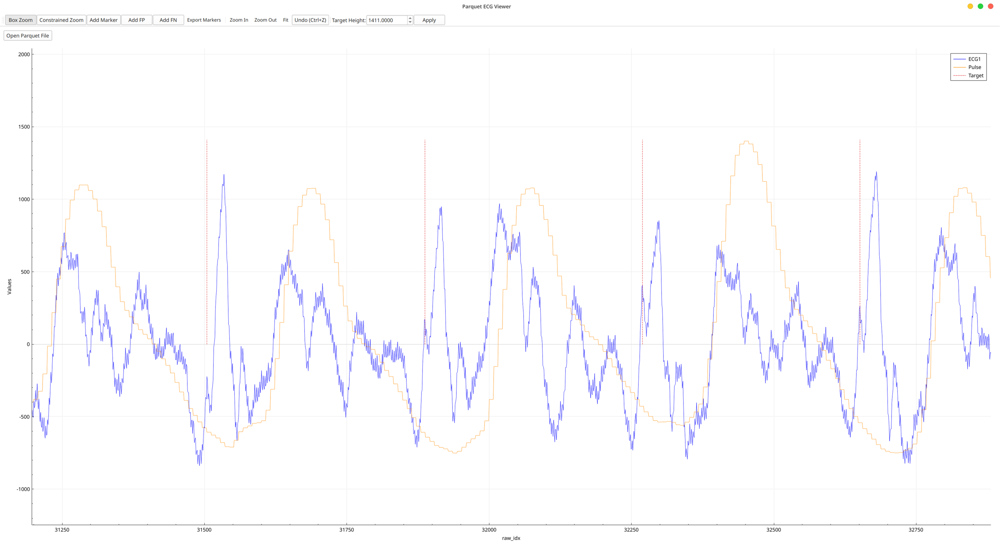
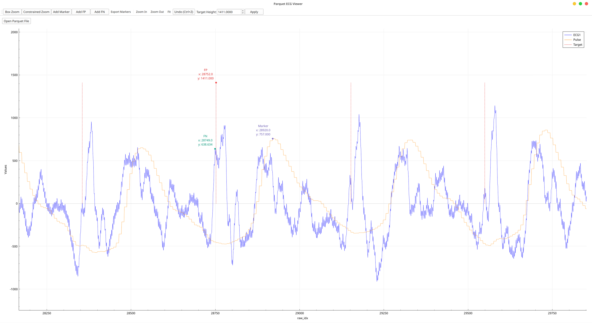

ParquetAnnotations is an interactive Linux desktop application for inspecting
ECG and pulse signals stored in Apache Parquet files. It overlays the ECG
waveform, pulse signal, and target annotations in a single responsive plot.

## Screenshots

## Features

- Interactive zooming, panning, and coordinate inspection
- Clear overlays for ECG, pulse, and target annotation data
- Smooth handling of datasets with up to 350,000 entries
- Sequential loading and inspection of Parquet files

## Technology

The application is written in C++ and uses Qt 6, Apache Arrow, Parquet C++, and
QCustomPlot. It is built with CMake and distributed under the GNU General Public
License v3.0.

[View the source code](https://github.com/selimct/ParquetAnnotations){.btn .btn-primary}
