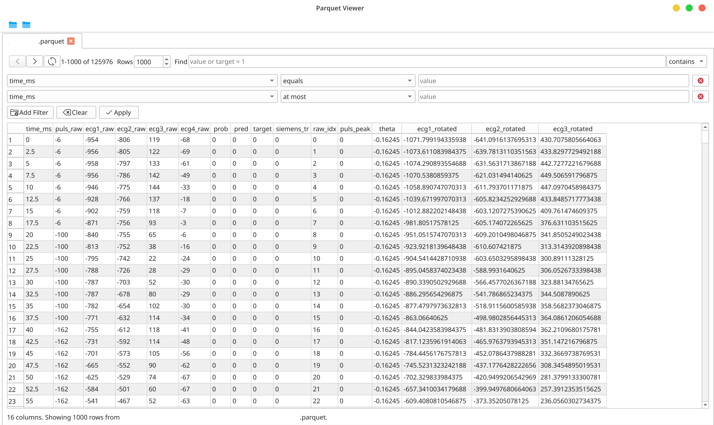

Parquet Viewer is a native desktop application for exploring Apache Parquet
files as tables. It is designed for Fedora and Ubuntu users who need a visual
workflow for inspecting large datasets without writing SQL queries.

## Screenshot

## Features

- VS Code-style file explorer and tabbed viewing of multiple files
- Paged table display for large datasets
- Global search across rows and columns
- Quick expressions such as `target = 1` and `score > 10`
- A visual filter builder for text, numeric, Boolean, and empty-value conditions
- DuckDB-backed scanning, filtering, and paging

## Technology

The application is written in C++20 with Qt 6 and CMake. DuckDB performs the
underlying Parquet queries, while the interface translates visual filters into
safe query expressions. It is free software under the GNU General Public
License v3.0 or later.

[View the source code](https://github.com/selimct/ParquetViewer){.btn .btn-primary}
